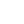

---

<table>
  <tr>
    <td align="center" width="72" height="72" style="border:1px solid #fff; border-radius:10px; padding:10px;">
       <b>HTML5</b>
    </td>
    <td align="center" width="72" height="72" style="border:1px solid #fff; border-radius:10px; padding:10px;">
       <b>CSS3</b>
    </td>
    <td align="center" width="72" height="72" style="border:1px solid #fff; border-radius:10px; padding:10px;">
       <b>JavaScript</b>
    </td>
    <td align="center" width="72" height="72" style="border:1px solid #fff; border-radius:10px; padding:10px;">
       <b>TypeScript</b>
    </td>
    <td align="center" width="72" height="72" style="border:1px solid #fff; border-radius:10px; padding:10px;">
       <b>Angular</b>
    </td>
  </tr>
</table>

 

<table>
  <tr>
    <td align="center" width="72" height="72" style="border:1px solid #fff; border-radius:10px; padding:10px;">
       <b>Node.js</b>
    </td>
    <td align="center" width="72" height="72" style="border:1px solid #fff; border-radius:10px; padding:10px;">
       <b>Spring</b>
    </td>
    <td align="center" width="72" height="72" style="border:1px solid #fff; border-radius:10px; padding:10px;">
       <b>Maven</b>
    </td>
    <td align="center" width="72" height="72" style="border:1px solid #fff; border-radius:10px; padding:10px;">
       <b>Swagger</b>
    </td>
  </tr>
</table>

 

<table>
  <tr>
    <td align="center" width="72" height="72" style="border:1px solid #fff; border-radius:10px; padding:10px;">
       <b>PostgreSQL</b>
    </td>
    <td align="center" width="72" height="72" style="border:1px solid #fff; border-radius:10px; padding:10px;">
       <b>MySQL</b>
    </td>
    <td align="center" width="72" height="72" style="border:1px solid #fff; border-radius:10px; padding:10px;">
       <b>MongoDB</b>
    </td>
  </tr>
</table>

 

<table>
  <tr>
    <td align="center" width="72" height="72" style="border:1px solid #fff; border-radius:10px; padding:10px;">
       <b>Docker</b>
    </td>
    <td align="center" width="72" height="72" style="border:1px solid #fff; border-radius:10px; padding:10px;">
       <b>Nginx</b>
    </td>
    <td align="center" width="72" height="72" style="border:1px solid #fff; border-radius:10px; padding:10px;">
       <b>Git</b>
    </td>
    <td align="center" width="72" height="72" style="border:1px solid #fff; border-radius:10px; padding:10px;">
       <b>GitLab</b>
    </td>
    <td align="center" width="72" height="72" style="border:1px solid #fff; border-radius:10px; padding:10px;">
       <b>K6</b>
    </td>
    <td align="center" width="72" height="72" style="border:1px solid #fff; border-radius:10px; padding:10px;">
       <b>Grafana</b>
    </td>
  </tr>
</table>

---

